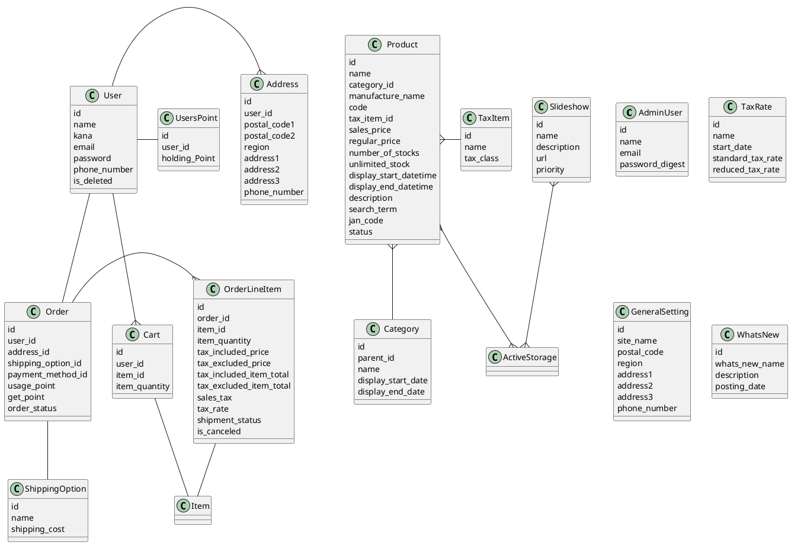

# クラス

```plantuml
@startuml
skinparam classAttributeIconSize 0
 
class AdminUser {
id
name
email
password_digest
}

class Category {
id
parent_id
name
display_start_date
display_end_date
}

class TaxItem {
id
name
tax_class
}

class Product {
id
name
category_id
manufacture_name
code
tax_item_id
sales_price
regular_price
number_of_stocks
unlimited_stock
display_start_datetime
display_end_datetime
description
search_term
jan_code
status
}

class ActiveStorage {
}

class TaxRate {
id
name
start_date
standard_tax_rate
reduced_tax_rate
}

class Slideshow {
id
name
description
url
priority
}

class GeneralSetting {
id
site_name
postal_code
region
address1
address2
address3
phone_number
}

class User {
id
name
kana
email
password
phone_number
is_deleted
}

class UsersPoint {
id
user_id
holding_Point
}

class Address {
id
user_id
postal_code1
postal_code2
region
address1
address2
address3
phone_number
}

class Cart {
id
user_id
item_id
item_quantity
}


class Order {
id
user_id
address_id
shipping_option_id
payment_method_id
usage_point
get_point
order_status
}

class OrderLineItem {
id
order_id
item_id
item_quantity
tax_included_price
tax_excluded_price
tax_included_item_total
tax_excluded_item_total
sales_tax
tax_rate
shipment_status
is_canceled
}

class ShippingOption {
id
name
shipping_cost
}


 


class WhatsNew {
id
whats_new_name
description
posting_date
}

User -{ Cart
User -{ Address
User - UsersPoint
Cart -- Item
Product }-- Category
Product }- TaxItem
Product }--{ ActiveStorage
Slideshow }--{ ActiveStorage
User -- Order
Order -{ OrderLineItem
Order -- ShippingOption
OrderLineItem -- Item


@enduml
```
