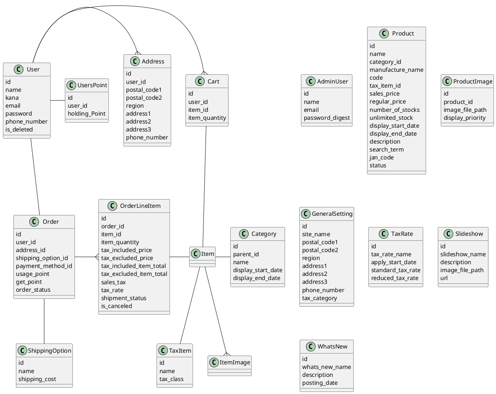

# EC
ECサイトシステム

## Description
小規模のECサイトに適用できるシステムの作成を目指します。

Ruby version: 2.5.3  
Node.js version: v10.14.2

## Features
TODOが落ち着いたらまとめます。
画面プロトタイプ  
https://xd.adobe.com/view/d687c39a-22be-4ea5-602e-b42616449c4c-a0b6/?hints=off

## TODO
以下の機能を予定しています。*は優先度が高いもの。
- [ ] フロントエンド
  - [ ] グローバルナビゲーション
    - [ ] ヘッダーコンテンツ
    - [ ] フッッターコンテンツ
  - [ ] ホームコンテンツ
  - [ ] アカウント
  - [ ] 注文履歴
  - [ ] サインイン
  - [ ] サインアウト  
  - [ ] カート
  - [ ] 注文

- [ ] グローバルナビゲーション
  - [ ] ヘッダーコンテンツ
    - [ ] ニュース
    - [ ] カテゴリメニュー
    - [ ] 商品検索ボックス*
    - [ ] アカウントメニューへのリンク*
    - [ ] カートへのリンク*
    - [ ] ヘルプへのリンク
  - [ ] フッッターコンテンツ
    - [ ] サイトマップ
---
- [ ] トップページコンテンツ
  - [ ] スライドショー*
  - [ ] おすすめ商品*
  - [ ] 人気商品*
  - [ ] 閲覧した商品*
  - [ ] 購入した商品*

- [ ] アカウントメニュー
  - [ ] アカウントの作成*
  - [ ] サインイン
    - [ ] メールアドレス認証*
    - [ ] OAuth認証（Twitter・GitHub）
    - [ ] 二段階認証
  - [ ] アカウントの変更*
  - [ ] サインアウト*
  - [ ] 注文履歴*
    - [ ] 注文履歴の表示*
    - [ ] 注文内容の変更・キャンセル
  
- [ ] カート*
  - [ ] カート内容の表示・編集
  - [ ] 注文ページへのリンク
- [ ] 注文
  - [ ] 注文の変更*
    - [ ] 届け先変更
    - [ ] 支払い方法変更
    - [ ] ポイント使用
    - [ ] 分割配送
  - [ ] 注文確定*
---
- [ ] 管理コンソール
  - [ ] kユーザー管理
  - [ ] ユーザー管理
  - [ ] 注文管理*
  - [ ] 商品管理*
    - [ ] 商品検索
    - [ ] 商品情報登録
    - [ ] 商品管理
    - [ ] カテゴリ管理
  - [ ] コンテンツ管理*
    - [ ] スライドショー登録
    - [ ] おすすめ商品登録
  - [ ] 税率管理*
  - [ ] 会社情報管理*

、商品検索、カート、新・旧税率の切り替え（10%・8%）、軽減税率をおおまかな

modelの作成
- [ ] admin_user：管理コンソールログインユーザー
- [ ] user：エンドユーザー
- [ ] item：商品
- [ ] item_img：商品画像（複数登録するため）
- [ ] category：カテゴリー
- [ ] order：注文

- [ ] AdminUser
  - [ ] 新規登録
    - [ ] 管理ユーザーが登録できること
    - [ ] 管理ユーザーが複数登録できること
  - [ ] 更新
    - [ ] 管理ユーザーが更新できること
    - [ ] 管理ユーザーが複数更新できること
  - [ ] 削除
    - [ ] 管理ユーザーが削除できること
    - [ ] 管理ユーザーが複数削除できること
  - [ ] バリデーションをおこなう
    - [ ] ユーザー名の確認をおこなう
      - [ ] ユーザー名が必須であること
      - [ ] ユーザー名が2〜40文字であること
    - [ ] メールアドレスの確認をおこなう
      - [ ] メールアドレスが必須であること
      - [ ] メールアドレスが半角であること
      - [ ] メールアドレスが4〜64文字であること
      - [ ] 有効なメールアドレスであること
      - [ ] 重複したメールアドレスは許可しないこと
    - [ ] パスワード項目の確認をおこなう
      - [ ] パスワードが必須であること
      - [ ] パスワードが半角英数字記号であること
      - [ ] パスワードが6〜32文字であること
      - [ ] パスワードがハッシュ化されていること

id
user_name
email
password

- [ ] 商品データをDBから取得する
  - [ ] SQLインジェクションを検証する
    - [ ] 商品データを取得する

  - [ ] 商品データを取得する
    - [ ] 商品データを全件取得する
    - [ ] 商品データを商品名を指定して取得する

- [ ] 商品データを一覧形式で表示する
  - [ ] 商品データを一覧形式で表示する
- [ ] 商品データを一覧形式で表示する
  - [ ] 商品データを取得する
  　　- [ ] 商品データを全件取得する
  　　- [ ] 商品データを全件取得する
  - [ ] 商品データを一覧形式で表示する

bin/rails g model item name:string, category_id:integer, manufacture_name:string, code:string, tax_item_id:integer, sales_price:integer, regular_price:integer, number_of_stocks:integer, unlimited_stock:boolean, display_start_date:datetime, display_end_date:datetime, description:string, search_term:string, jan_code:string, status:integer

## Tempus Dominus
カレンダーコントール用
yarn add tempusdominus-bootstrap-4
https://tempusdominus.github.io/bootstrap-4/

参考URL
https://qiita.com/yaju/items/2cbe5e5914c5be08820a

# FontAwesome
WebFont
https://fontawesome.com/

