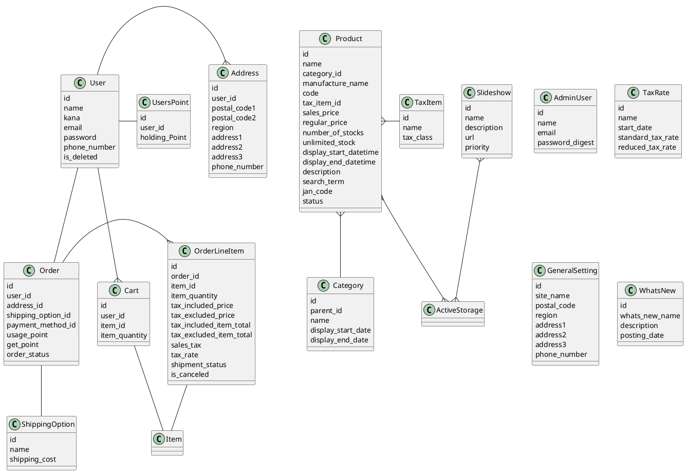

# EC
ECサイトシステム

## Description
小規模のECサイトに適用できるシステムの作成を目指します。

Ruby version: 2.5.3  
Node.js version: v10.14.2

# 使用ライブラリ
## MagicImage
ActiveStrageでサムネイルを使用する時のGem mini_magickで必須。
```$ brew install imagemagick```

## Tempus Dominus
カレンダーコントール用
yarn add tempusdominus-bootstrap-4
https://tempusdominus.github.io/bootstrap-4/

参考URL
https://qiita.com/yaju/items/2cbe5e5914c5be08820a

# FontAwesome
WebFont
https://fontawesome.com/

# YubinBango
住所検索用JavaScriptライブラリ
https://github.com/yubinbango/yubinbango

# カルーセル
フロントページのおすすめ商品一覧用に追加
https://github.com/kenwheeler/slick/

## Features
TODOが落ち着いたらまとめます。
画面プロトタイプ  
https://xd.adobe.com/view/d687c39a-22be-4ea5-602e-b42616449c4c-a0b6/?hints=off


# クラス



