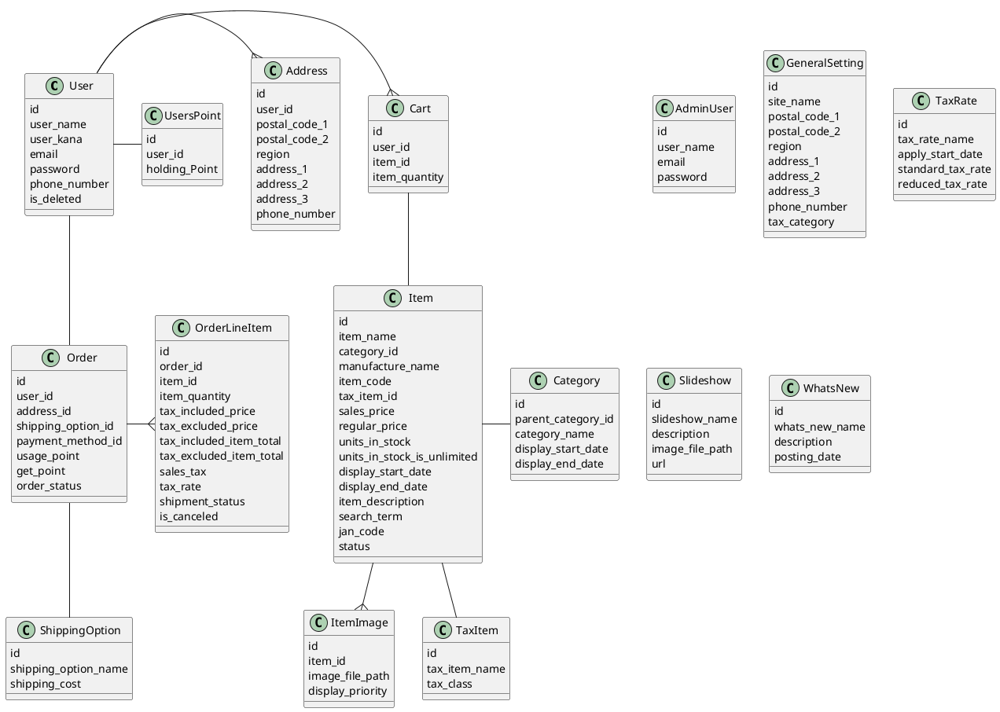

# EC
ECサイトシステム

## Description
小規模のECサイトに適用できるシステムの作成を目指します。

Ruby version: 2.5.3  
Node.js version: v10.14.2

## Features
TODOが落ち着いたらまとめます。
画面プロトタイプ  
https://xd.adobe.com/view/d687c39a-22be-4ea5-602e-b42616449c4c-a0b6/?hints=off

## TODO
以下の機能を予定しています。*は優先度が高いもの。

- [ ] グローバルナビゲーション
  - [ ] ヘッダーコンテンツ
    - [ ] ニュース
    - [ ] カテゴリメニュー
    - [ ] 商品検索ボックス*
    - [ ] アカウントメニューへのリンク*
    - [ ] カートへのリンク*
    - [ ] ヘルプへのリンク
  - [ ] フッッターコンテンツ
    - [ ] サイトマップ
---
- [ ] トップページコンテンツ
  - [ ] スライドショー*
  - [ ] おすすめ商品*
  - [ ] 人気商品*
  - [ ] 閲覧した商品*
  - [ ] 購入した商品*

- [ ] アカウントメニュー
  - [ ] アカウントの作成*
  - [ ] サインイン
    - [ ] メールアドレス認証*
    - [ ] OAuth認証（Twitter・GitHub）
    - [ ] 二段階認証
  - [ ] アカウントの変更*
  - [ ] サインアウト*
  - [ ] 注文履歴*
    - [ ] 注文履歴の表示*
    - [ ] 注文内容の変更・キャンセル
  
- [ ] カート*
  - [ ] カート内容の表示・編集
  - [ ] 注文ページへのリンク
- [ ] 注文
  - [ ] 注文の変更*
    - [ ] 届け先変更
    - [ ] 支払い方法変更
    - [ ] ポイント使用
    - [ ] 分割配送
  - [ ] 注文確定*
---
- [ ] 管理コンソール
  - [ ] ユーザー管理
  - [ ] 注文管理*
  - [ ] 商品管理*
    - [ ] 商品検索
    - [ ] 商品情報登録
    - [ ] 商品管理
    - [ ] カテゴリ管理
  - [ ] コンテンツ管理*
    - [ ] スライドショー登録
    - [ ] おすすめ商品登録
  - [ ] 税率管理*
  - [ ] 会社情報管理*

、商品検索、カート、新・旧税率の切り替え（10%・8%）、軽減税率をおおまかな

modelの作成
- [ ] admin_user：管理コンソールログインユーザー
- [ ] user：エンドユーザー
- [ ] item：商品
- [ ] item_img：商品画像（複数登録するため）
- [ ] category：カテゴリー
- [ ] order：注文

- [ ] 商品データをDBから取得する
  - [ ] SQLインジェクションを検証する
    - [ ] 商品データを取得する

  - [ ] 商品データを取得する
    - [ ] 商品データを全件取得する
    - [ ] 商品データを商品名を指定して取得する

- [ ] 商品データを一覧形式で表示する
  - [ ] 商品データを一覧形式で表示する
- [ ] 商品データを一覧形式で表示する
  - [ ] 商品データを取得する
  　　- [ ] 商品データを全件取得する
  　　- [ ] 商品データを全件取得する
  - [ ] 商品データを一覧形式で表示する

